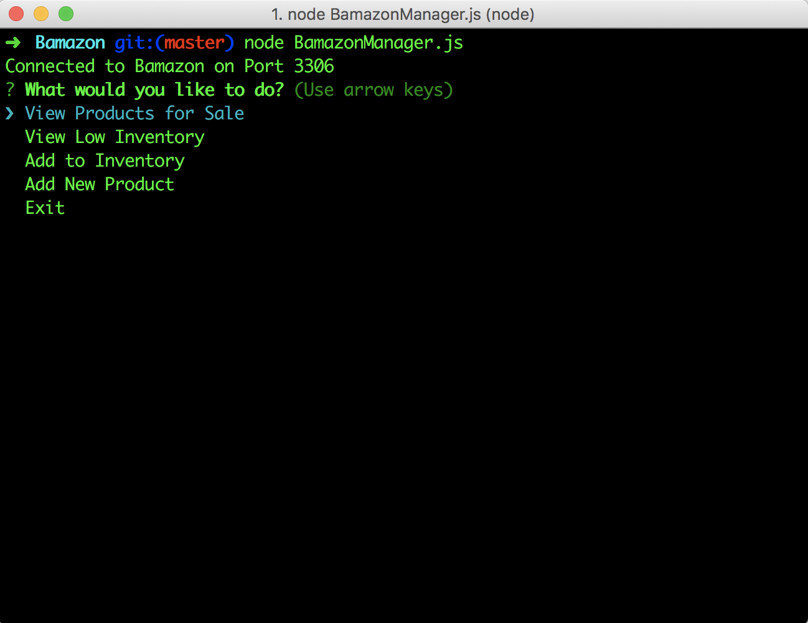
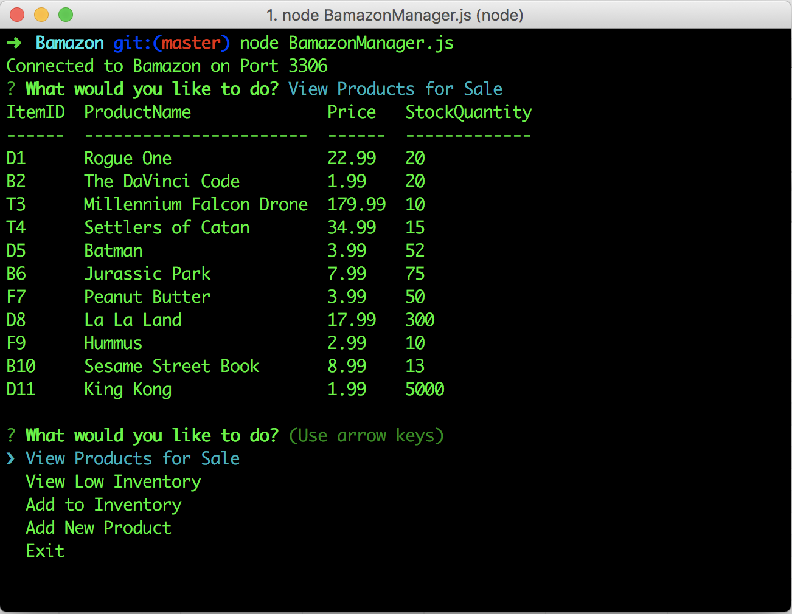
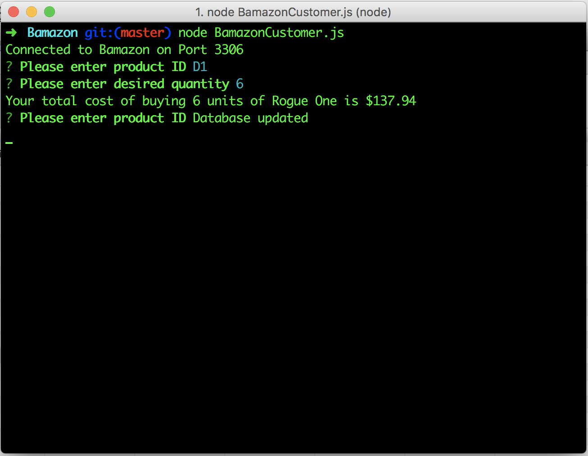
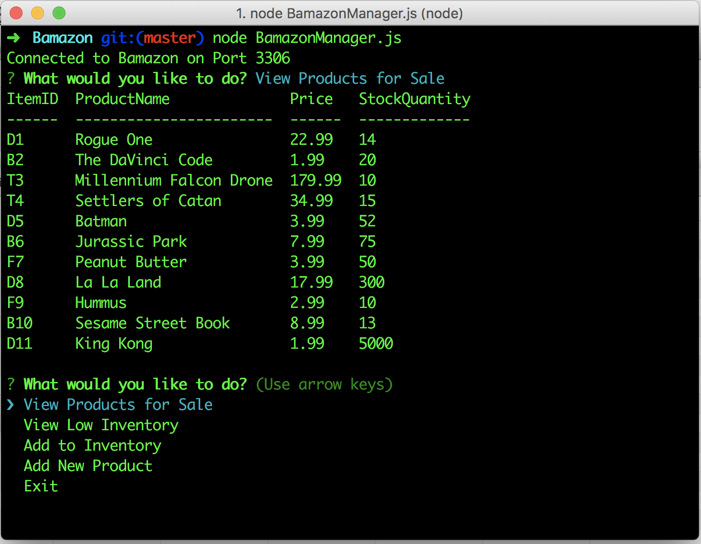
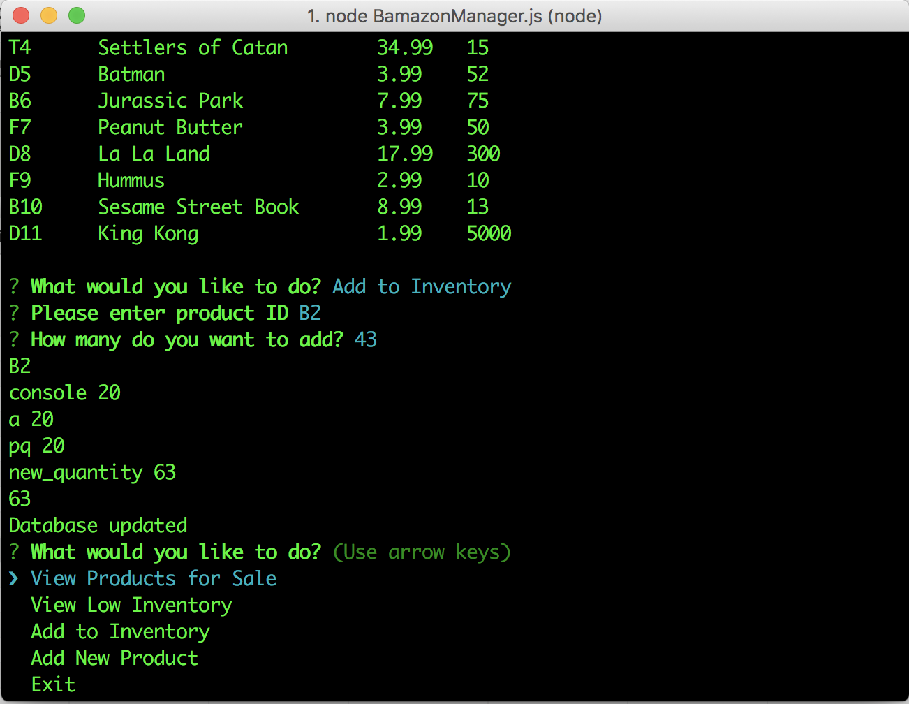
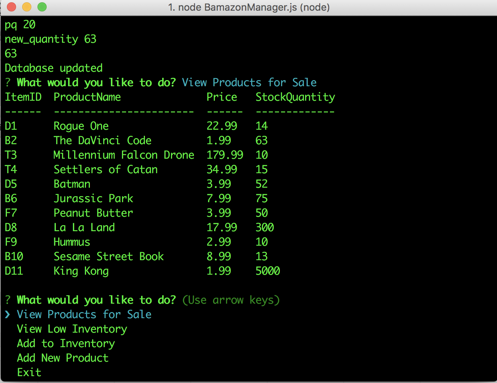
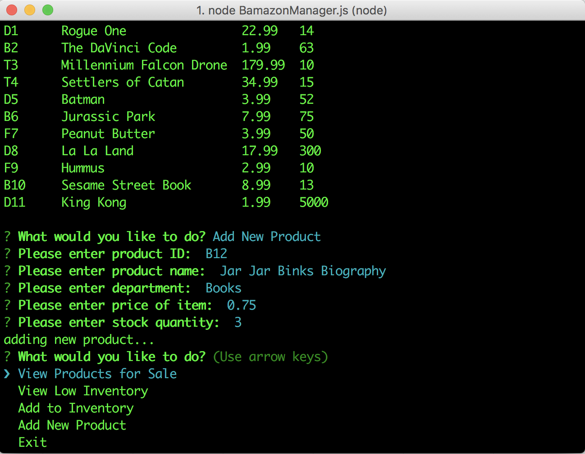
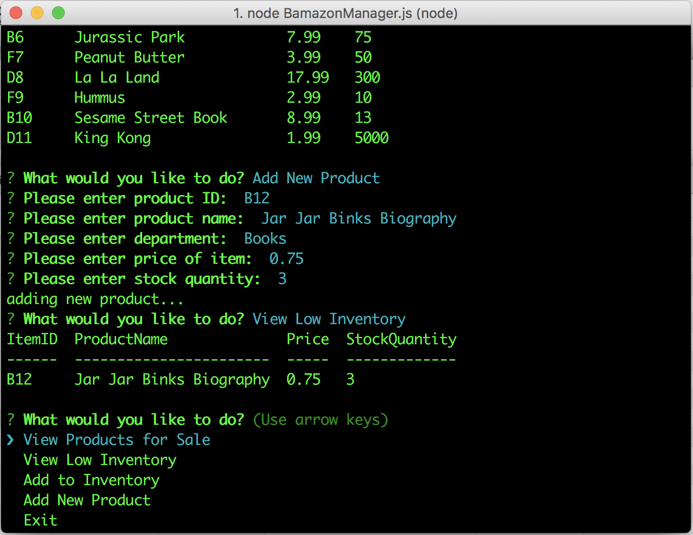
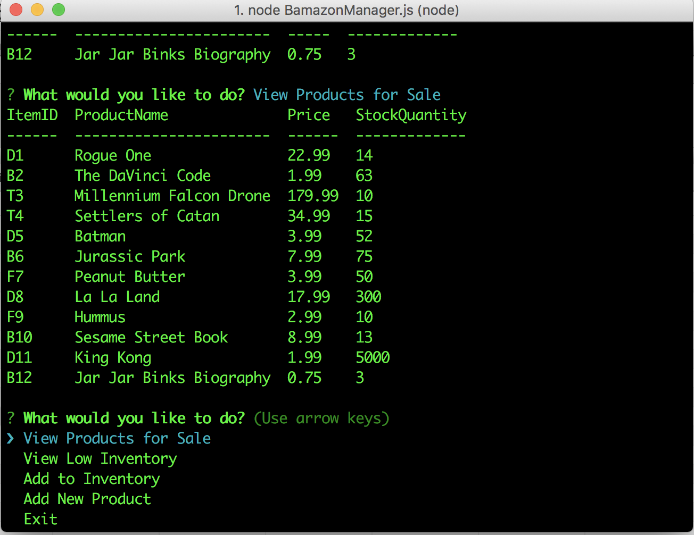

# Bamazon

This is a Amazon-like marketplace manager designed in Node.js.

This contains a BamazonManager program and a BamazonCustomer program.

This is the default Manager screen.

Here the inventory is displayed.

Using the Customer Program, a user purchases 6 units of Rogue One.

The quantity of Rogue One units is updated.

A user decides to add 43 copies of The Da Vinci Code to inventory. 

And the Da Vinci Code inventory is updated.

Three copies of a new product are added.

The low inventory is displayed.

The updated inventory is displayed.

